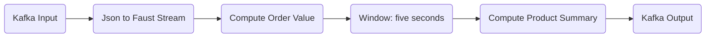

# Streaming Analytics:
## Use Case
### Input Kafka topic: real time orders
### Data format: json
`
{
    'account_id': '12345',
    'product': "Keyboard",
    'amount': 3,
    'price': 150.00
}
`
### Goals:
- analyze every 5 seconds
    - Product wise total value: amount * price
    - Compute product summary
- Publish the product summary result to product_summary topic

## Design

## Implementation
1. Producer service: generate order json data randomly and publish to kafka input
2. Consumer service: 
* consume stream data
* compute order value
* compute product summary in each window 5 seconds
* publish to kafka output
3. Kafka cluster
