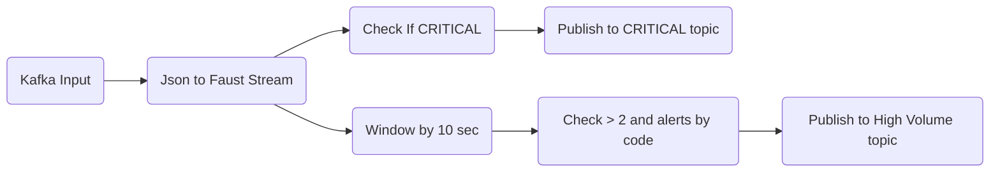

# Streaming Thresholds and Alert:
## Use Case
### Input Kafka topic: real time exception logs
### Data format: json
`
{
    'timestamp': '2023-09-20T05:20:39',
    'level': "CRITICAL",
    'code': "400",
    'message': "This is a CRITICAL alert"
}
`
### Goals:
- when level = CRITICAL, send to a topic for critical alerts
- Same code occurs > two times in 10 seconds, send summary to a topic for high-volume alerts

## Design

## Implementation
1. Producer service: generate order json data randomly and publish to kafka input
2. Consumer service: 
* consume stream data
* compare CRITICAL issue and publish to kafka
* compute and check exception appear > 2 in each window 10 seconds and publish to kafka
3. Kafka cluster
4. Kafdrop tool for viewing messing in kafka

## Testing
- Assuming we are running docker service
- Open terminal and change to project folder
- Run this command to start services

`
docker-compose -f docker_compose.yml up
`
- That above command will start kafka cluster, kafkrop, producer, customer
- We can view product_summary using http://localhost:9000
- There are other useful commands to work with this project

`
docker-compose -f docker_compose.yml down
`

`
docker-compose -f docker_compose.yml build
`

## References
- https://faust-streaming.github.io/faust/playbooks/vskafka.html
- https://github.com/faust-streaming/faust